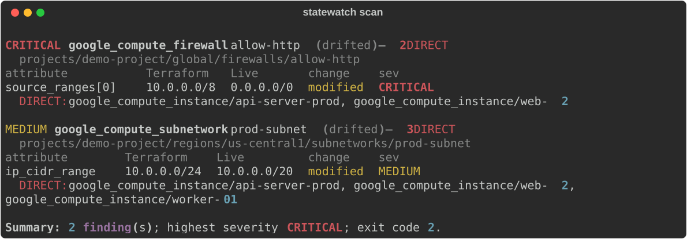

# statewatch

**Your infrastructure drifted. statewatch tells you what breaks.**

A dependency-aware drift detector for GCP. It compares live Cloud Asset Inventory state
against your Terraform state, builds a resource dependency graph (including dependencies
Terraform itself doesn't track), and reports, per drift, **how bad it is** and **what
else is affected**.

Detection is commodity — every tool tells you a field changed. The hard question on call
at 2 AM is *"what does this break?"* That's what statewatch answers.



## Install

```bash
pip install statewatch
```

Python 3.11+. Apache-2.0.

## Quickstart

```bash
# 1. Point it at your Terraform state and GCP project (needs roles/cloudasset.viewer)
statewatch scan --tfstate ./terraform.tfstate --project my-gcp-project

# 2. See the dependency graph it builds (text | json | dot)
statewatch graph --tfstate ./terraform.tfstate --project my-gcp-project --format dot | dot -Tpng > graph.png

# 3. Generate a starter config
statewatch init --tfstate ./terraform.tfstate --project my-gcp-project
```

No GCP project handy? Add `--stub` to any `scan` for an offline demo against bundled
sample state. State can also live in GCS: `--tfstate gs://my-bucket/env/prod.tfstate`.

## What statewatch does

- **Severity × impact, not just "drift detected."** Every finding carries a severity
  (CRITICAL / MEDIUM / LOW) *and* a blast radius — the resources that depend on the
  drifted one, labelled **DIRECT** (one hop), **INDIRECT** (two hops), or **WATCH**
  (further, or low-propagation drift). `CRITICAL firewall drift — 2 DIRECT` is a
  different alert than `drift detected`.
- **A real dependency graph.** Built automatically from Terraform `depends_on`, from
  manual edges in `statewatch.yaml`, and — the defensible part — **inferred from resource
  attributes**: a subnet referenced in an instance's `subnetwork` field, or a firewall
  that applies to an instance by tag, is a real dependency even when `depends_on` never
  mentions it. Terraform doesn't track those. statewatch does.
- **Exit codes for CI.** `0` clean · `1` low/medium drift · `2` critical, or any drift
  with a significant blast radius. Wire it into a pipeline and the build fails when it
  should.

Resource types in v0.1: `google_compute_instance`, `google_compute_firewall`,
`google_compute_subnetwork`, `google_container_cluster`.

## Who this is for

statewatch is for **SRE on-call, incident response, and large-scale Terraform setups** —
the engineer staring at drift in infrastructure they didn't write, who needs to triage
fast, and any setup where implicit dependencies live in attribute fields that Terraform's
own dependency tree doesn't capture.

**It is not for everyone, and that's deliberate.** If you wrote the Terraform and you're
the one running `plan`, you know what depends on what — `terraform plan` is enough and you
don't need this. statewatch earns its keep when the person seeing the drift *isn't* the
person who wrote the code, or when there are too many simultaneous drift events to triage
by hand. Underclaiming who it's for is the point.

One honesty note: statewatch uses **severity as a heuristic proxy for whether drift
propagates** to dependents. It is not dataflow analysis and doesn't claim to be — the
terminal output and JSON say so too.

## Why statewatch and not …

| | what it tells you | what it doesn't |
|---|---|---|
| `terraform plan` | exactly what *your* config would change | nothing about live drift you didn't cause; only what's in the dependency tree |
| Terraform Cloud drift detection | a resource drifted | what *else* is affected; implicit attribute-level dependencies |
| driftctl | unmanaged / drifted resources, broadly | severity, and the downstream blast radius |
| **statewatch** | what drifted, how bad, **and what depends on it** | it's GCP-only, detection-only (no auto-fix), and intentionally narrow in audience |

statewatch is a *complement* to `terraform plan`, not a replacement.

## How it works

```
GCP live state            Terraform state
(Cloud Asset Inventory)   (local file or gs://)
        └──────────┬──────────┘
                   ▼
        normalize → structural diff
                   ▼
      severity classifier   dependency graph
                   └─────────┬────────┘
                             ▼
            impact analyzer (walk predecessors)
                             ▼
        severity × impact report  (terminal · JSON · Slack · GitHub PR)
```

Impact flows *against* dependency edges: when B drifts, the affected resources are B's
transitive predecessors (everything that depends on B).

## Running in CI

A GitHub Action ships in this repo (`action.yml`): it runs a scan, upserts a single
findings comment on the PR, and fails the check when statewatch exits `2`.

```yaml
- uses: google-github-actions/auth@v2
  with: { workload_identity_provider: ..., service_account: ... }
- uses: pyjeebz/statewatch@v0.1.0
  with:
    tfstate: gs://my-bucket/env/prod.tfstate
    project: my-gcp-project
```

Slack notifications and `--watch` (continuous, notify-only-on-new-drift) are configured
via `statewatch.yaml` — run `statewatch init` to scaffold one.

## Future

statewatch is the intelligence layer — *what changed and what it breaks*. **v0.2** adds
drift attribution: *who* changed it and *when*, by correlating GCP Audit Logs. AWS and
Azure adapters are open for community contribution behind a stable adapter interface; the
runtime layer is a separate, later effort.

## Roadmap

- **v0.2** — drift attribution (Audit Logs: actor, method, timestamp). Opt-in.
- AWS adapter (Config + CloudTrail) and Azure adapter (Resource Graph + Activity Log) —
  community contributions welcome; see [CONTRIBUTING.md](CONTRIBUTING.md).
- Tracked, deliberately-deferred items live in [KNOWN_ISSUES.md](KNOWN_ISSUES.md).

## Contributing

The adapter and per-resource-type seams are designed for external contribution —
[CONTRIBUTING.md](CONTRIBUTING.md) explains the `CloudAdapter` interface and how to add a
resource type without touching the engine.

## License

Apache-2.0. See [LICENSE](LICENSE).
